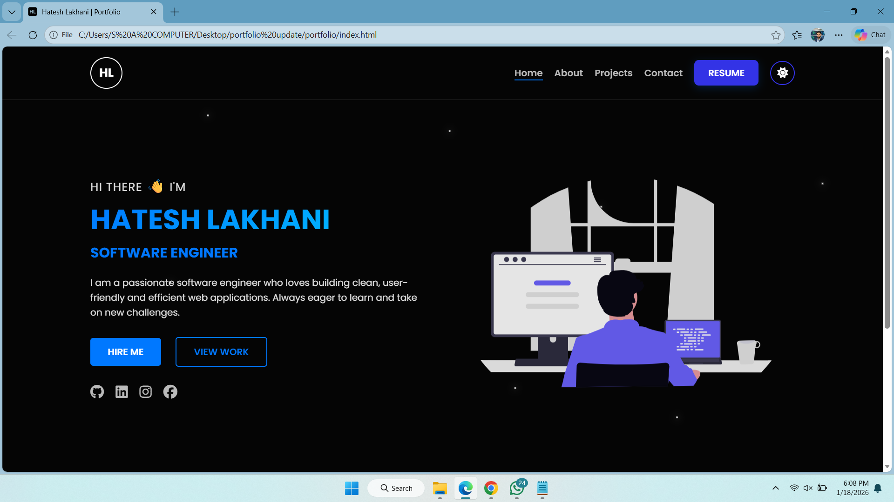

# 🌐 Hatesh Lakhani — Professional Portfolio v2.0

> A fully-featured, modern web portfolio built with **HTML5, CSS3, and Vanilla JavaScript —**
> featuring dark/light themes, real-time email integration, responsive design down to 250px, and interactive UI components.

---

## 🔗 Live Demo
👉 **Live View:**  [View My Portfolio](https://hatesh1.github.io/portfolio/)

---
### 🖥️ Preview
*Experience the sleek Dark Mode interface and responsive design.*



---

## 🧑‍💻 About
I’m **Hatesh Lakhani**, a Software Engineer (BS Software Engineering, Virtual University).  
This portfolio highlights my projects, skills, and experience — with a focus on simplicity, design, and responsiveness.  
Built to reflect continuous learning, it evolves as I explore new technologies like JavaScript, frameworks, and backend integration.

---

## ✨ Key Features
- 🌗 **Dark / Light mode toggle** with smooth transition  
- 📱 **Fully Responsive** (Mobile → Tablet → Desktop → Large Screens)
- 🎯 **Consistent Typography** & professional color palette
- 🧭 **Sticky navigation bar** with smooth scrolling  
- 🧩 **Project cards** with hover zoom effects
- 🔄 **Smooth Animations** & transitions across all interactions 
- ✉️ **Clickable contact info** (Email / Phone)  
- 📄 **Downloadable Resume button**
- ♿ **Improved Accessibility** with semantic HTML & ARIA labels
- 🎨 Clean UI with subtle animations & modern color theme  

---
## ⚡ Functionality
- ✉️ **Live Contact Form** with EmailJS integration
- 🛎️ **SweetAlert2 Notifications** for form states & interactions
- 📄 **Interactive Project Cards** with hover effects & modals
-🔗 **Sticky Navigation** with active section highlighting
- 📱 **Mobile-Optimized Menu** with toggle animations
- 📥 **One-Click Resume Download**
- 🧭 **Breadcrumb Navigation** for better UX

---

## 💎 Technical Excellence
- **🧹 Clean, Modular CSS** with BEM-like naming conventions
- **📁 Organized File Structure** for easy maintenance
- **🚀 Fast Loading** with optimized assets
- **🔍 SEO Optimized** with meta tags & structured data
- **📝 Well-Commented Code** for readability

---

## 💻 Tech Stack
- **Frontend:** HTML5 (Semantic), CSS3 (Flexbox, Grid, Custom Properties/Variables), and Scroll-based Animations.
- **Interactivity:** Vanilla JavaScript (ES6+) for theme persistence, EmailJS integration, SweetAlert2 modals, and custom circular progress animations.
- **Version Control:** Git & GitHub (Branch Management, Professional Commit History, and Repository Maintenance).
- **Hosting & Deployment:** Netlify (Continuous Deployment from GitHub) with optimized build settings.

---

## 📦 Libraries & Integrations
- **EmailJS** (Real-time email notifications)
- **SweetAlert2** (Beautiful alert modals)
- **Font Awesome** (Icons)
- **Google Fonts** (Typography)

---

## 🛠️ Tools & Deployment
- **Development:** VS Code (Visual Studio Code)
- **Debugging:** Chrome DevTools (Responsive testing & Console debugging)
- **Version Control:** Git & GitHub (Professional workflow)
- **Hosting:** Netlify / GitHub Pages

---

## 📁 Folder Structure
```
portfolio/
├── index.html          # Homepage
├── about.html          # About Me page
├── projects.html       # Projects showcase (updated)
├── contact.html        # Contact form (with EmailJS)
│
├── assets/
│   ├── images/         # All images & screenshots
│   ├── resume.pdf      # Downloadable resume
│   └── icons/          # Favicon & UI icons
│
├── css/
│   ├── styles.css      # Global styles & variables
│   ├── home.css        # Homepage specific
│   ├── about.css       # About page specific
│   ├── projects.css    # Projects page (updated)
│   └── contact.css     # Contact page (updated)
│
├── js/
│   ├── main.js         # Global logic, Theme toggle & Scroll animations
│   ├── about.js        # Experience timeline & About section dynamics
│   ├── project.js      # Project filtering & Preview modals logic
│   └── contact.js      # EmailJS integration & Form validation handlers
│
└── README.md           # Documentation
```


## 🚀 How to Run

1. Clone or download this repository  
2. Open `index.html` in any modern web browser  

---

## 💻 Run Locally


1. Clone this repository:
```bash
git clone https://github.com/hatesh1/portfolio.git
cd portfolio
2. Open index.html in your browser to view locally.
(Just double-click or drag it into Chrome.)

3. For better testing (using a local server):
# if you have Python 3 installed
python -m http.server 5500
```

---

## 🔮 Future Improvments
- **Performance Optimization:** Implementing Lazy Loading for images and minifying CSS/JS assets for faster load times.
- **Advanced Framework:** Migrating the entire portfolio to React.js or Next.js for better state management and SEO.
- **Headless CMS Integration:** Connecting a CMS like Sanity or Strapi to manage projects and blogs without touching the code.
- **Unit Testing:** Adding automated tests using Jest or Cypress to ensure form validation and UI stability.
- **Custom Domain:** Linking a professional .com or .dev domain name for a more personalized brand identity.

---

## 📞 Connect With Me

* 📧 **Email:** [hateshlakhani9@gmail.com](mailto:hateshlakhani9@gmail.com)
* 💼 **GitHub:** [github.com/hatesh1](https://github.com/hatesh1)
* 🔗 **LinkedIn:** [linkedin.com/in/hatesh-lakhani](https://www.linkedin.com/in/hatesh-lakhani)
* 🌐 **Portfolio:** [hatesh1.github.io/portfolio](https://hatesh1.github.io/portfolio/)

---

## ⚖️ License
- This project is **MIT Licensed.**
- Feel free to fork, reuse, or modify it for your own purposes — just give proper credit to the original author.

---

## 🙋‍♂️ Author
**Hatesh Lakhani** Software Developer | Passionate about clean UI & responsive design
- 📫 **Get in touch:** hateshlakhani9@gmail.com
- 🌐 **LinkedIn:** Hatesh Lakhani

**📝 Note:** This portfolio will continue to evolve as I learn and add new features like advanced animations, headless CMS integration, and more interactive demos.
- **Last Updated:** January 2026 **| Version: 2.0** 🚀

---
